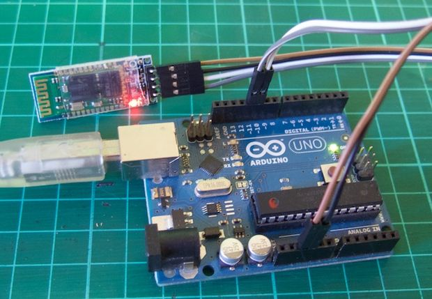

HC06
====

Demonstration code for our HC06 Bluetooth module. Visit the product page at the
following URL:
http://tronixlabs.com/breakout-boards/bluetooth/bluetooth-to-uart-serial-wireless-adaptor/
for product information, tutorial links and more.

Connection
==========

Arduino <---> Bluetooth Module

5V to Vcc
GND to GND
D10 to TX
D11 to RX

Links
=====

http://www.instructables.com/id/Tutorial-Using-HC06-Bluetooth-to-Serial-Wireless-U/

