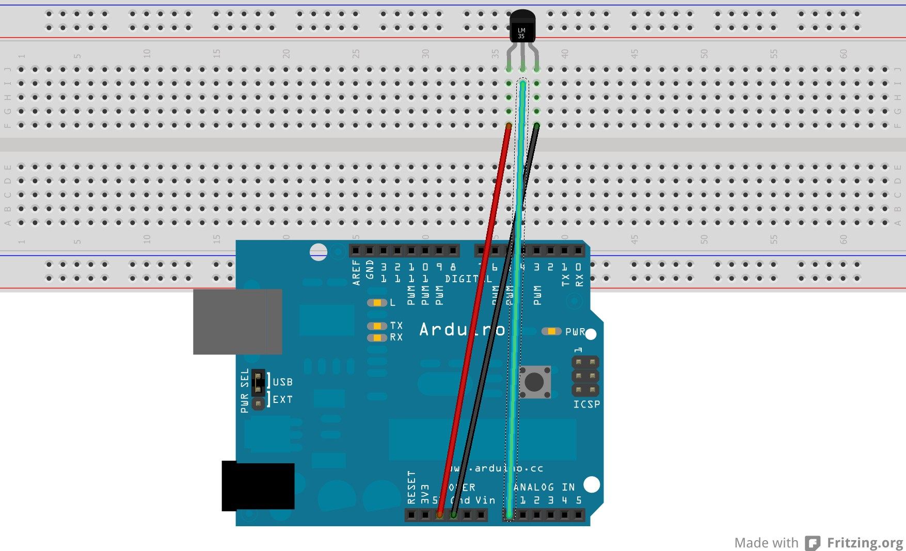

HC06
====

Demonstration code for oBluetooth module. Visit the product page at the
following URL:
http://tronixlabs.com/breakout-boards/bluetooth/bluetooth-to-uart-serial-wireless-adaptor/
for product information, tutorial links and more.

Connection
----------

Arduino <---> Bluetooth Module

5V to Vcc
GND to GND
D10 to TX
D11 to RX

Pairing
-------

Name HC-06

PIN 1234

Links
-----

[HC06](http://www.instructables.com/id/Tutorial-Using-HC06-Bluetooth-to-Serial-Wireless-U/)

LM35
====

Links
-----

[LM35HigherResolution](http://playground.arduino.cc/Main/LM35HigherResolution)

[aref](http://tronixstuff.com/2013/12/12/arduino-tutorials-chapter-22-aref-pin/)

