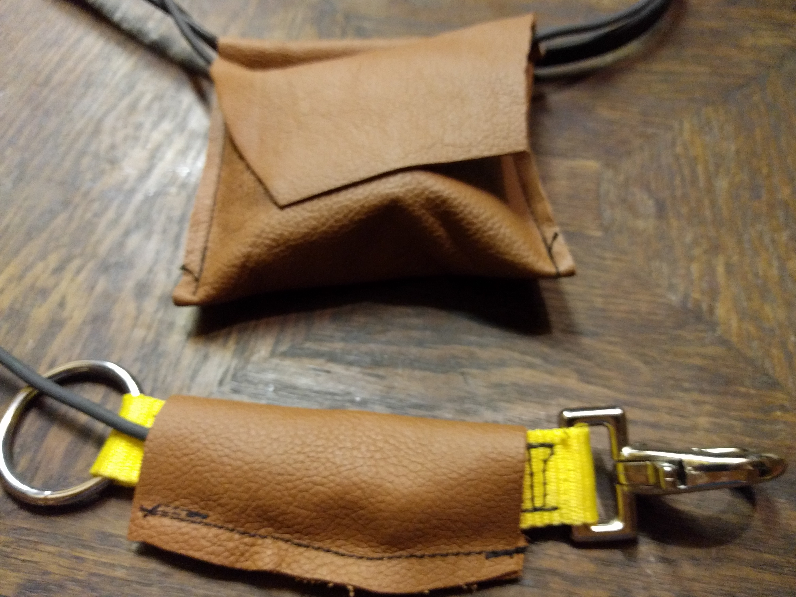

# Zügelkraftmesser

In der Reiterei wird der Zügel nicht nur überbewertet sondern auch inflationär
genutzt. Die Kräfte die dort aufgewendet werden stehen in keinem Verhältnis zu
dem Umstand, daß sich da ein Stück Metall im Pferdemaul an der anderen Seite
befindet. Wie schön wäre es, wenn man die Kraft am Zügel live messen und
vielleicht in einem Video des Rittes visulisieren könnte.


## Foto(love)story

Man braucht dazu im Grunde nur gängige Hardware. Ein Arduino kann als Computer
genutzt werden (Duemilanove ca 20€, Nachbauten 3€), die Übertragung der Daten
kann per Bluetooth erfolgen, das typischer weise 10, bzw sogar 100 Meter
überbrücken kann. Es gibt fertige Komponenten für den Arduino (HC-06 ca 3€).
Hier eins der ersten Bilder des Arduino mit der Bluetooth-Komponente (und einem
Lautsprecher zu Testzwecken):


Die Sensoren findet man in jeder digitalen
[Personenwaage](https://www.ebay-kleinanzeigen.de/s-sortierung:preis/personenwaage/k0)
(sogar gleich 4 davon) aus Kleinanzeigen oder vom Sperrmüll (meine kamen vom
Claus, Danke!) oder kann sie auch neu kaufen (ca 2x 8€). Zwei Verstärker
(kleinere, grüne Platine im Bild) sind nötig (HX-711, ca 2x 2€), um die beiden
Sensoren auszulesen. Ein Testaufbau nur mit einem Verstärker und zwei Sensoren
in Reihe (in der Personenwaage sind alle vier Sensoren auf komplizierte Art
verschaltet um unterschiedliche Belastungen auszugleichen). Alles löte ich auf
ein "Shield" (je nach Lieferant 1-10€), dass einfach auf den Arduino gesteckt
wird. Der erste Aufbau mit einem Verstärker und zwei Sensoren beweist, dass die
Sensoren auf dem Müll nicht kaputt gehen und ich die Sache so grob verstanden
habe:


Direkt aus China kommen die Teile, allerdings mit 2 bis 3 Wochen Lieferzeit.
Hier das Shield und die Bluetooth-Komponente und einige Pfostenstecker (die ich
allerdings nicht verwende, ich nehme eine Pfostenleiste, da ich auf mein Shield
kein weiteres stecken will und weil ich damit Abstand zum Arduino bekomme, der
noch einen ur-alt USB-Anschluss enthält, der so hoch ist, dass er an die
Lötstellen auf einem Shield kommt und Kurzschlüsse verursacht):


Die Komponenten werden auf einer Platine fest verlötet um gegen die Rüttelei
beim Reiten gefeit zu sein:


Alles verdrahtet: Der vollständige, funktionierende Aufbau. Es fehlt nur noch
die Verlängerung bis zur Trense und die schützenden Gehäuse:


Die Sensoren werden mittels Steckverbindungen (Klinkenbuchsen ca 2x 1€,
vorgefertigtes Kabel mit Stecker ca 2x 2€) unabhängig angeschlossen:


Um den Sensor, der für Druck ausgelegt ist, wird ein Band gelegt, um den Zug
am Zügel zu messen. Das Band drückt den Sensor auf die gleiche Weise bei Zug
zusammen, als ob der Sensor (wie in der Waage) durch Gewicht zusammengedrückt
wird:


Beschläge hoher Qualität sorgen für die Sicherheit, daß sie am Zügel nicht
abreissen:


Leider war der Hersteller nicht interessiert, so kleine Mengen (zwei) zu
verkaufen. Darum musste ich zu Massenware wechseln, die zudem etwas gross und
schwer ist.

Der Übergangswiderstand der Klinkgenstecker ist zu gross und variabel und wird
beim Bewegen der Stecker mitgemessen. Mühselig muß ich sie wieder entfernen und
die Platine vom Lötzinn säubern. Und da mit den Klinkensteckern keine Messung
möglich war, bin ich unsicher ob meine Überlegung lieber Widerstände mit hoher
Genauigkeit dafür aber etwas anderem Wert (900 statt 880 Ohm) zu nehmen,
überhaupt funktioniert.

Die Lust weiterzumachen verliess mich ersteinmal für ein paar Wochen, bis ich
ein paar Kindern beim Löten zuschaute.

Das gab den richtigen Anstoss und ich lötete die Kabel fest an das Shield:


Langsam wird es ziemlich friemelig:


Am schlimmsten finde ich die Brücken, die man auf dem Experimentierboard löten
muss. Eine schöne Lösung dafür habe ich noch nicht gefunden. Im Internet habe
ich sogar Bilder gesehen, wo die Lötstellen noch schlimmer aussahen als bei
mir:


Nach Fertigstellung aller Lötstellen steht die Nagelprobe: Geht es überhaupt?
Wenn nicht, heisst es, alle neuen Lötstellen nachzulöten, was unschön ist, weil
die Brücken alles andere als Stabil sind. Im flüssigen Lötzinn haftet die
Brücke lieber an der Lötspitze als der Stelle, wo sie hingehört.

Aber es funktioniert! Auf Anhieb! Meine Begeisterung kennt keine Grenzen.

Dann geht es an die Zügelführung, links die Riemen mit den Befestigungen und
den Sensoren in der Mitte:


Das Batteriepack für den mobilen Einsatz:


Nun noch die Riemen nähen:


Dann die Sensoren festnähen und Lederummantelung anbringen um die Komponenten
vor der rauen Welt der Reiterei zu schützen:



Ein alter Martingalriemen erlaubt das Umhängen des Arduino:


Und schliesslich muss alles tariert und skaliert werden:


### Der erste Testlauf

Zwei Reiter und Pferde stellen sich zu einem ersten Testlauf zur Verfügung. Der
Verschnallung funktioniert gut, nur der Halsriemen könnte für dieses Pferd mit
dem kräftigen Hals etwas länger sein:


Wärend des Reitens kann man die Balken prima beobachten und mit den gesehenen
Hilfen und Reaktionen des Pferde abgleichen. Es wird klar, dass die App zu den
Werten einen Video aufzeichnen muss. Auf jeden Fall macht es Spass zu
fachsimpeln, was man da eigentlich sieht.

Die App zeichnet alle Werte und den Messzeitpunkt auf, auf Knopfdruck kann die
Aufzeichnung in eine tsv-Datei exportiert und auf den Notebookk gebracht
werden. Hier kann sie weiter analysiert werden. Eine übliche
Tabellenkalkulation kommt schnell aus dem Tritt, aus 2800 Datenpunkten ein
Diagramm zu erzeugen, gnuplot ist da etwas toleranter:

[](alles.png)

und spuckt auch gleich eine Statistik mit den üblichen Berechungen aus:

| | Left | Right |
|-|-|-|
| **FILE:**       |                     |                    |
| Records:        |      2816           |     2816           |
| Out of range:   |         0           |        0           |
| Invalid:        |         0           |        0           |
| Column headers: |         0           |        0           |
| Blank:          |         1           |        1           |
| Data Blocks:    |         1           |        1           |
| **COLUMN:**     |                     |                    |
| Mean:           |    1321.9338        |   1988.9884        |
| Std Dev:        |     972.3105        |   1543.9554        |
| Sample StdDev:  |     972.4832        |   1544.2296        |
| Skewness:       |       1.1944        |      1.0376        |
| Kurtosis:       |       7.4340        |      4.0549        |
| Avg Dev:        |     774.5797        |   1231.1619        |
| Sum:            | 3 .72257e+06        | 5.60099e+06        |
| Sum Sq.:        | 7 .58320e+09        | 1.78531e+10        |
|                 |                     |                    |
| Mean Err.:      |      18.3227        |     29.0950        |
| Std Dev Err.:   |      12.9561        |     20.5733        |
| Skewness Err.:  |       0.0462        |      0.0462        |
| Kurtosis Err.:  |       0.0923        |      0.0923        |
|                 |                     |                    |
| Minimum:        |       0.3000 [1941] |      0.1000 [ 821] |
| Maximum:        |    9661.5000 [1890] |   8953.1000 [2297] |
| Quartile:       |     541.2000        |    783.5000        |
| Median:         |    1187.5000        |   1665.9000        |
| Quartile:       |    1940.8500        |   2879.2000        |

In die Grafik kann man hineinzoomen und sich zB einen Moment anschauen, an dem
die Reiterin einen Handwechsel vornahm:

[](handwechsel.png)

## Die Technik

### Kraftsensoren

Die Sensoren beruhen auf einer sogenannten
[Wheatstone-Bridge](https://en.wikipedia.org/wiki/Wheatstone_bridge), sie
erlaubt das Messen und dann Digitalisieren minimaler Änderungen von
Widerständen. Dazu werden 3 konstante (S1-3) und ein variabler (S4) Widerstand
in einer Raute zusammengeschaltet. Die minimale Änderung des einen Wiederstands ruft
eine Änderung des Potentials zwischen den linken und rechten Polen aus, eine
Spannung, die sich verstärken und dann digitalisieren lässt:


Der Verstärker ist ein HX-711, er braucht auf der Arduino-Seite PWM-fähige
Eingänge:


Die Sensoren kommen mit drei Anschlüssen und enthalten nur 2 der 4 nötigen
Widerstände:


### Bluetooth

Die Bluetooth-Lösung ist etwas... gewalttätig. Wenn man sich klar macht, welche
Prozessorleistung nötig ist, um Bluetooth umzusetzen und was ein Arduino
vermag, passt beides im Grunde nicht zusammen. Da heute auch performante
Prozessoren billig und stromsparend sind, gibt es für den Arduino
Erweiterungen, die die gesamte Bluetooth-Thematik erledigen. Vermutlich steckt
auf der Platine ein ARM Prozessor (ein kleiner Bruder dessen, was wie in
unseren Smartphones haben) neben dem primitiven Prozessor des Arduino. Die
Verdrahtung ist also vergleichsweise einfach, Masse, Power, In und Out (4
Kabel):


### Temperatur

Der Arduino ist mit Bluetooth und zwei Kraftsensoren ausgereizt. Er besitzt nur
6 PWM fähige Pins (wenn man den USB-Anschluss zum Debuggen nicht verlieren
will) und jeweils zwei werden pro Komponente benötigt. Nur für einfache D/A
Wandlung sind weitere Pins verfügbar.

Es ist also Platz, zB auch die Temperatur zu messen (da es so simpel ist),
hierfür gibt es Bauteile (LM-35, weniger als 1€), die dies recht einfach mit
dem Arduino vermögen:


## Source-Code

Schliesslich müssen Programme entwickelt werden. Ein kleines Programm auf dem
Arduino liest die Daten von den Sensoren und übergibt sie an die Komponente die
diese per Bluetooth überträgt. Da Smartphones verfügbar und mobil sind, eignen
sie sich am besten, um die Daten empfangen. Die beste Möglichkeit ist eine
Android-App, die Entwicklung für IOS ist zu aufwendig und andere Systeme zu
wenig verbreitet.

### Arduino-Programm

Das Programm für den Arduino ist übersichtlich. Von Debug-Statements und
Kommentaren befreit sind es nur ein paar Zeilen:

```
#include "HX711.h"
#include <SoftwareSerial.h>

SoftwareSerial BT(11, 3);
HX711 LoadCell_1;
HX711 LoadCell_2;
static const unsigned long min_wait = 3L;
static const unsigned long frequency = 5L;

void setup() {
	BT.begin(9600);
	LoadCell_1.begin(9, 10);
	LoadCell_1.set_scale(2280.f);
	LoadCell_1.tare();
	LoadCell_2.begin(5, 6);
	LoadCell_2.set_scale(2280.f);
	LoadCell_2.tare();
	BT.println();
	BT.println("tick;tock;left;right");
}

void loop() {
	unsigned long tick = millis();
	delay(1000 / frequency / 2);
	digitalWrite(13, HIGH);
	float current_millis=0;
	float tock=millis();
	float left_force=0;
	float right_force=0;
	current_millis = tick / 1000.0;
	left_force = LoadCell_1.get_units();
	right_force = LoadCell_2.get_units();
	tock = (millis() - tock) / 1000.0;
	BT.print(current_millis, 3);
	BT.print(";");
	BT.print(tock, 3);
	BT.print(";");
	BT.print(left_force, 1);
	BT.print(";");
	BT.print(right_force, 1);
	BT.println();
	if (BT.available()) {
		switch (BT.read()) {
			default:
				BT.println("no function yet");
			break;
		}
	}
	digitalWrite(13, LOW);
	tick += 1000L / frequency - min_wait;
	while (millis() < tick) {
		delay(min_wait);
	}
}
```

### Android-App

Die Android-App zeigt die beiden Zügelkräfte in grün/gelb/roten Balken an (wie
das Logo der App, siehe oben). Sie kann sich bereits zum Mess-Adapter verbinden,
zeigt die Werte mithilfe der Balken an, zeichnet aber noch nicht auf. Auch ein
synchrones Video ist noch nicht enthalten.

Der Sourcecode für die App (und das Arduino-Programm) wird auf Github unter
[biikuta](https://github.com/emdete/biikuta) veröffentlicht.

## Rückschläge

Kalte Lötstellen sind das größte Problem: Man sieht sie nicht und sie lauern
irgendwo in der Schaltung. Am Ende lötet man alle Stellen erneut und erzeugt
dabei schlimmstenfalls eine Neue. Obwohl die Schaltung simpel ist und die
Komponenten für Bluetooth und Signalverstärkung auf jeweils einer Platine
integriert sind, kommen bei dem Projekt bereits leicht 100 Lötstellen zusammen.

Es stellt sich heraus, daß die Steckverbindung keine gute Idee es, der Kontakt
ist scheinbar nicht gut genug. Die Messung wird durch den Übergangs-Widerstand
beeinflusst.

## Rechtliches

Die naheliegende Idee, Zügelkräfte zu messen, die Daten per Funk zu Übertragen
und auch weitere Messwerte (Schenkelkräfte, Gewichtseinwirkung, Kraft auf den
Nasenriemen, Puls, ...) einzubeziehen lies sich am 31. März 2010 bereits Heinz
Gross unter [DE202010000515U1](https://www.google.com/patents/DE202010000515U1)
patentieren, das Patent ist aber wohl wegen verstrichener Fristen abgelaufen.
Anmeldender Anwalt war damals Jochen Hansen von [Kanzlei
HQuadrat](http://www.patent-marke-design.de/). Eine Nähe zu meiner Idee ist
ausserdem Ausgeschlossen, da die Messung explizit mit Dehnungsmessstreifen zur
Gewichtsoptimierung umgesetzt wird. Ich setze aber auf Biegesensoren zur
Kostenoptimimierung.

Auch die Zeitschrift Cavallo nutzt in einem Bericht eine ähnliche Apparatur:
[Zügel-Messung mit drei
Pferden](https://www.cavallo.de/training-fuers-pferd/zuegelmessung-pferde-wuenschen-sanfte-anlehnung.1325694.233219.htm)
vom 15. Februar 2015. Auch hier werden aber Biegesensoren eingesetzt. Darin
erwähnen sie eine Zügelmessung die 10 Jahre vorher stattgefunden hat, also weit
vor dem Patenteintrag.

## Urheber


Michael Dietrich setzt diese Idee um, dieser Blogeintrag wurde am 10. Dezember
2017 begonnen, die Idee und Arbeiten an dem Projekt bereits im Dezember 2015.

